# Colours & Pickups

[← Back to index](README.md)

Two things this game asks you to read off the screen at a glance, and neither is written down anywhere else: what the colours on the maps mean, and what a thing lying on the floor is before you walk over it.

Everything here is fixed. It never changes with the level's styleset, the difficulty, or a loaded WAD texture pack — a WAD swaps wall, floor and door art only, and never touches a marker, a pickup or a key.

## Reading the corner minimap

The always-on panel in the corner. No fog-of-war: the layout is all there from the moment the level loads.

| What you see | Colour | Meaning |
|---|---|---|
| Walls | the level's own muted wall tone | varies by styleset — it's the one colour here that does |
| Locked door | red, blue, green or violet | needs that colour's key |
| Branch door | dull tan `#b39a72` | Switchboard spur — no key, just walk into it |
| Acid | orange `#ff9d1f` | see the note below — it's green in the world |
| Spike trap | pulsing red / flat grey | pulsing means armed, grey means retracted right now |
| Proximity mine | bright red `#ff5050` | only once you've spotted it |
| Teleporter pad | violet `#a855f7` | |
| Uncollected key | gold `#f2d64b` | see the note below — *not* the key's own colour |
| Lore terminal | pulsing cyan | stops pulsing once you've read it |
| Exit | pulsing green | always visible, from the moment the level loads |
| You | near-white triangle | the point of the triangle is the way you're facing |
| Teammates | their own player colour, on a dark surround | multiplayer only; the same colour their name floats in above them in the world |
| A teammate calling for help | their colour, brightened, with a sweeping ring | multiplayer only — see [Multiplayer](multiplayer.md) |
| Enemies | their own body colour | gold Elite, cyan Edge Case — but only once spotted |

Two of those will catch you out, so they're worth stating plainly:

**Acid is orange on the map and green in the world.** That's deliberate, not an oversight. The exit marker is a pulsing green, and it is the single most important thing on the panel — so acid gets a hot, non-green colour specifically so a glance can never confuse "the way out" with "the floor that hurts". The maps agree with each other; it's the 3D view that's the odd one out.

**A key marker is gold no matter which key it is.** All four colours show up identically here, so the panel tells you *where* a key is, not *which* one. The colour you're missing is on the HUD key pips, and on the door itself.

The dark surround behind a teammate dot is doing real work: the player colours include a green very close to the exit marker's and an amber very close to the key gold, so the outline is what stops a person reading as a place you can walk to.

Keys **ping** on the minimap: the marker brightens and a sonar ring sweeps out of it for a few seconds. Two things set that off — walking into a locked door you have no key for, and simply passing a room that still holds a key you can reach. "Reachable" means by walking distance, counting doors you already hold the key for. When the key you were asked for is itself locked away, the ping deliberately points at the key that unblocks it instead, so what pings is always somewhere you can go next.

A teammate calling for help pings the same way but is never confusable with it: a key ping is gold and sits still on a key, a help ping is that player's own colour and moves with them, and it comes with a siren instead of the key ping's soft chime.

## Reading the automap

`Tab` opens the automap. Same tiles, a different palette, and one real difference in what's on it. It also rotates to match the way you're facing, unless you switch it to north-up in Settings — the shot below is a rotated one, which is why the level sits at an angle.

Structural things go greyscale here so the map doesn't fight the live game still rendering behind it; danger and goals keep their accent colours.

The whole level is drawn from the moment it loads, so that shot is what you get on arrival rather than after exploring — and the game showing through behind is not an artefact of the picture: the automap really is translucent, and really does leave you able to walk and fight while it's up.

| What you see | Colour | Meaning |
|---|---|---|
| Wall | light grey `#c8c8ce` | |
| Floor | very faint grey wash | |
| Locked door | muted red, blue, green or violet | desaturated versions of the same four |
| Branch door | warm tan `#b39a72` | warm against the locked door's cool — "push it" vs "needs a key" |
| Teleporter pad | near-white `#e8eaf0` | brightest structural tone, so it still reads for navigation |
| Lore terminal | mid grey `#b4b8ba` | |
| Spike trap | red `#e02818` armed / grey `#8a8a90` safe | |
| Acid | orange `#ff9d1f` | same accent as the minimap |
| Proximity mine | bright red `#ff5050` | |
| Exit | green `#41ff6e` | always, from the moment the level loads |
| You | warm gold `#ffd23f` | the one warm colour, so it never blends into terrain or accents |
| Teammates | their own player colour, on a dark surround | multiplayer only; brightened and ringed while one is calling for help |

The one difference from the corner minimap:

- **It doesn't draw keys at all.** The corner minimap is the only place an uncollected key shows up.

It used to be two: the automap was fog-of-war and only drew tiles near somewhere you'd walked. That's gone — the corner minimap never had fog, so the small always-on panel was showing you *more* of the level than the big one you deliberately opened. Both now show the whole layout.

What the map still doesn't hand you: **secret rooms** (their walls are indistinguishable from solid rock until you open them — that's deliberate and unaffected), **mines you haven't spotted**, and, in multiplayer, **loot dropped by a teammate who disconnected**, which stays hidden until someone has been near that room so it can't broadcast where they dropped out.

One thing neither map will do: **an unopened secret wall is drawn exactly like a plain wall** on both. That's deliberate — a map that marked secrets would give away every one of them. The only hint is a very slight colour tint in the normal 3D view, up close.

## Reading an exported map PNG

The **Export Map as PNG** button, which appears below the canvas once you've cleared a level, is not a colour-coded diagram — it's the level itself, seen from above. It stamps the actual wall, door, floor, acid, teleporter, spike and lore-terminal textures the game drew for you that session, so if you'd loaded a WAD texture pack, the export uses that pack's art too.

Only two things are painted on top of the textures:

| Marker | Colour |
|---|---|
| Where you started | red |
| The exit | green |

Worth knowing when you look at one:

- **The empty rock around the level is cropped away.** The generator carves rooms out of a much larger solid block; the export only draws wall that a player could actually walk up to and see, then trims to what's left. So the image is the level, not a small maze adrift in a big rectangle.
- **A branch door looks like a plain door here** — it doesn't get its amber wash.
- **Secret walls look like walls here too**, on the same principle as the maps.

## What a dropped item looks like

Here's the thing to know before the table: **every pickup in the game is the same object.** A small dark square with a brighter square inside it, floating at about waist height. There is no health cross, no ammo box, no distinct shape per kind — colour is the *only* thing that tells them apart.

Here is the whole set side by side, exactly as the game draws them:

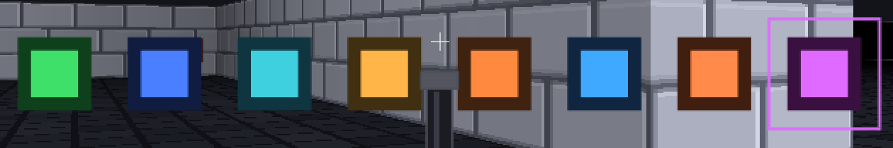

| Drop | | Colour | What it's for |
|---|---|---|---|
| Health | 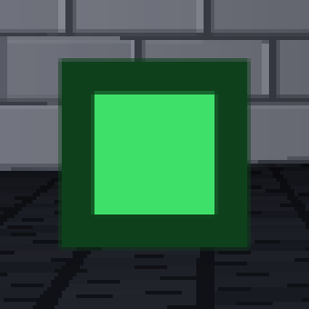 | green | System Stability |
| Swap | 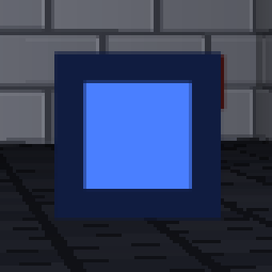 | deep blue | the armour buffer that soaks damage before your health does |
| Bullets | 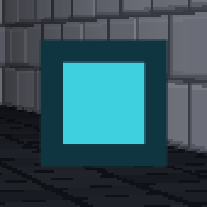 | cyan | echo pistol and Regex Shotgun |
| Shells | 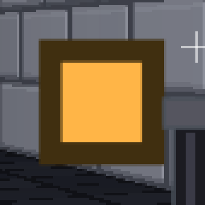 | amber | Regex Shotgun's own pool |
| Rockets | 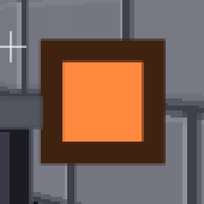 | hot orange | ghidra |
| SMG ammo | 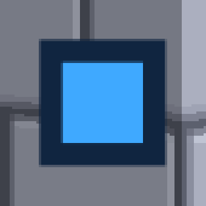 | bright blue | gdb |
| Gas | 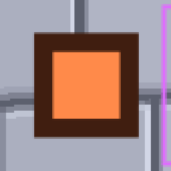 | fiery orange | Friday Hotfix |
| Weapon | 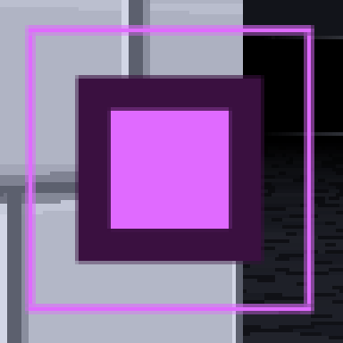 | violet, **with a pulsing ring** | a gun you don't own yet |

And the things you'd otherwise work out the hard way:

- **The weapon drop's pulsing ring is the only animation on any pickup.** Nothing in this game bobs, spins or glows on the floor — keys included. But "pulsing" on its own does not mean "pickup": a proximity mine breathes too, and it is the one thing down there that will hurt you. Tell them apart by shape, not by the flicker — a weapon drop is a square with a ring around it at waist height, a mine is a round dome sitting on the floor. See [What a mine looks like](#what-a-mine-looks-like).
- **All weapon drops look identical.** You can't tell a gdb from a ghidra from a Toolchain before you pick it up; the console line afterwards is what names it.
- **Rockets and gas are both orange** and genuinely close to each other. In practice it rarely matters: neither drops at all until you own the weapon that uses it.
- **Health is green and swap is blue**, which is the pair worth committing to memory — they're the two that decide whether you survive the next room.
- **A dropped item and a placed one look the same.** Something an enemy dropped when it died and something the level put there when it was built are drawn identically. There's no way to tell, and nothing depends on it.
- **One kill can leave up to three items stacked in the same spot** — a health drop, an ammo or swap drop, and a weapon are three separate rolls. If you walk over a kill site and hear more than one pickup, that's why.

## What a mine looks like

A **proximity mine** is a dark red dome on a wide base plate, with three prongs and a single bright lens that breathes in and out. It sits **on the floor** — it never floats — and you only see it once you are within about four and a half tiles of it.

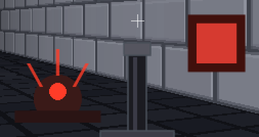

It is deliberately drawn next to the red keycard here, because for a long time it was not distinguishable from one: both were a dark red rectangle with a brighter red rectangle inside, and players learned to flinch away from red keys. **Shape is now the thing to read**, and it is the cue that survives distance and colour blindness — the mine is round and spiky and on the ground, a keycard is square and flat and floating. If it has prongs, do not walk into it.

You can shoot a mine you have spotted to destroy it from a safe distance — see [Tips](tips.md). Standing near one for about a second sets it off; backing out of range resets it.

## What a key looks like

A keycard: the same two-square shape as a pickup, slightly larger, floating at waist height — and in its own door's colour.

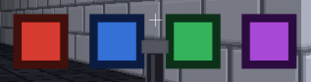

| Key | Opens |
|---|---|
| Red | the red room |
| Blue | the blue room |
| Green | the green room |
| Violet | the violet room |

The HUD carries the same four colours, one pip per locked room, in a block two wide. Here three are still out there and the blue one has been picked up:

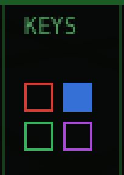

That's the whole system, and it's deliberately small:

- **At most four rooms are locked per level**, so a colour never repeats. The colour *is* the room's identity — there's never a "which red door did this one mean?"
- **A key opens every door of its room and is never spent.** Once you have it, that room is open for good, however many ways in it has.
- **Hollow means still out there, filled means you have it** — and a level with nothing locked shows a dash instead of pips. There's no held/total count, because which *colours* you have is the only thing that decides whether the door in front of you opens.
- **There's no yellow key**, which will look odd if you know Doom. Amber already means "Switchboard branch door — no key, just push it", and keeping those two apart matters more than matching a 1993 key set.

In co-op, keys are held by the **team**: whoever picks one up opens that room for everybody.
